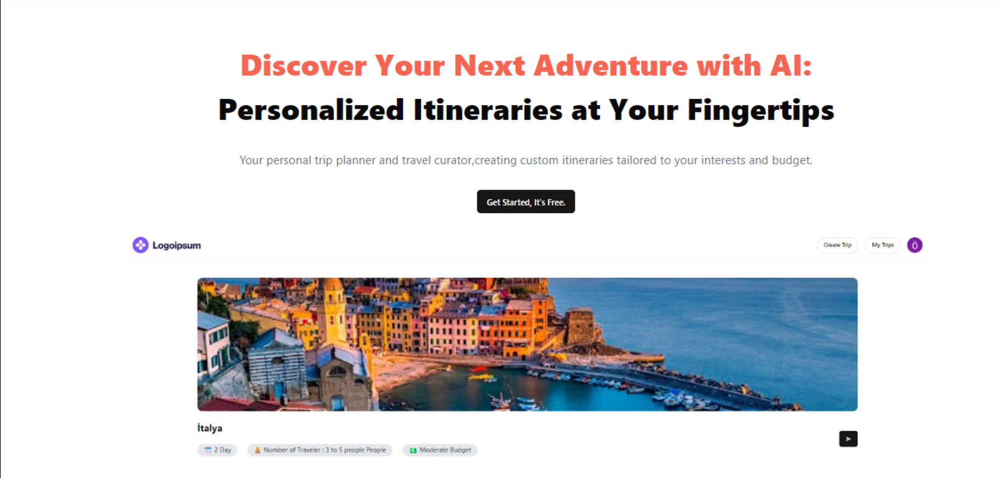
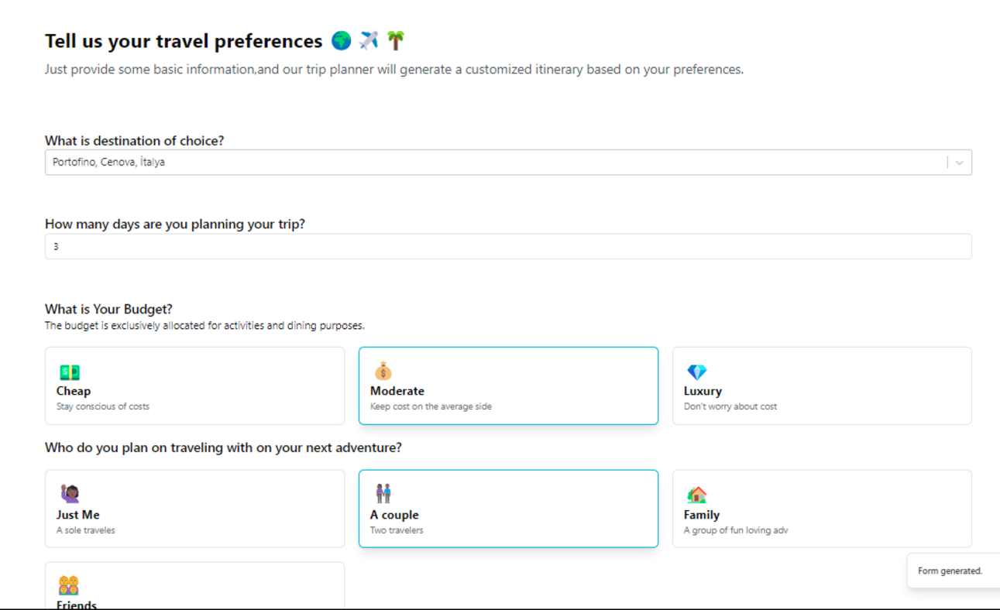
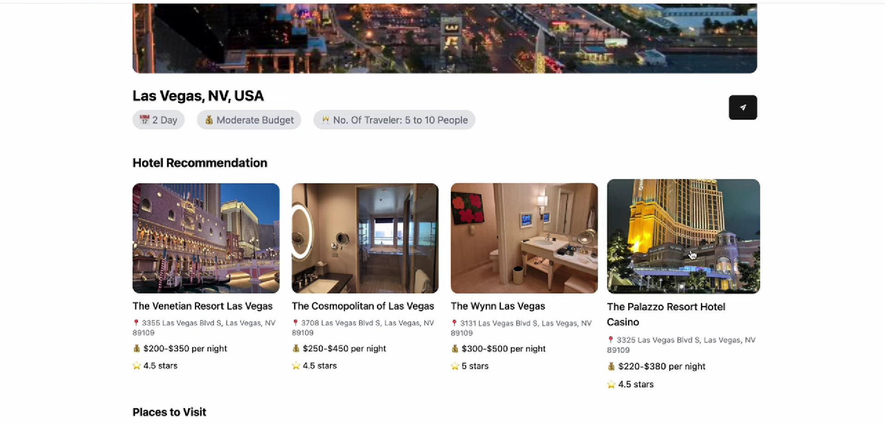

# **Plan My Trip ✈🧳🌎- An AI Trip Planner**

**Plan My Trip** is a powerful AI-driven travel planning application built using React and Firebase. It leverages Google APIs and AI to help users seamlessly create customized itineraries, including destinations, activities, hotels, and more.  

## **Features**

### 🌟 **Core Functionality**
- **Dynamic Trip Planning**: Generate personalized travel itineraries by inputting destination, budget, days, and travel companions.
- **Google API Integration**: Search for destinations using Google Places Autocomplete and fetch location details.
- **AI-Powered Suggestions**: Get smart recommendations for activities, hotels, and travel plans.

### 🛠️ **Technology Stack**
- **Frontend**: React with Vite for fast development and optimized performance.
- **Styling**: Tailwind CSS and ShadCN for a responsive and modern UI.
- **Backend**: Firebase Firestore for secure data storage and Google OAuth for user authentication.

### 🔒 **Secure Authentication**
- Google Sign-In with OAuth ensures secure and seamless user login.
- User sessions are stored securely in local storage.

### ⚙ **APIs Used**
- **Google Places API**: Autocomplete and place details.
- **Firebase Firestore**: User and trip data storage.
- **Google OAuth**: User authentication.

### 📋 **Key Features**
- **Trip Data Management**: Save generated trips in Firebase for future access.
- **Dynamic Routing**: View trip details using dynamically generated routes.
- **Responsive Design**: Optimized for all devices with grid-based layouts.

## ScreenShorts

